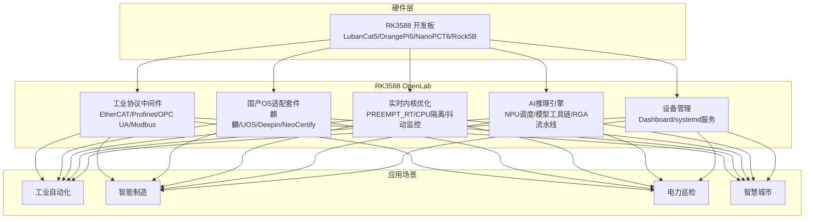

# RK3588 OpenLab — 让RK3588开发像树莓派一样简单

> 国内首个围绕RK3588芯片的"开源中间件+生态知识库"一体化平台

[](https://gitee.com/RK3588kaifa/RK3588-OpenLab)
[](LICENSE)
[](https://gitee.com/RK3588kaifa/RK3588-OpenLab)
[](https://github.com/yicechuhai/rk3588-industrial-toolkit)

---

## 🔥 最新性能 (2026-07-03)

| 版本 | FPS | 总延迟 | 解码 | 预处理 | NPU |
|------|-----|--------|------|--------|-----|
| **V7 (最优)** | **41.2** | **24.2ms** | 0.2ms | 8.7ms | 15.4ms |
| V0 (基线) | 13.8 | 61.3ms | 35.6ms | 7.1ms | 18.6ms |

> NanoPC-T6 LTS | yolov5s INT8 | MPP硬解码 | RTSP 2688×1520 | 详见 [BENCHMARK.md](docs/BENCHMARK.md)

## 为什么有这个项目？

瑞芯微RK3588是国产芯片中计算性能最强的旗舰处理器（8核 4×A76+4×A55，6TOPS NPU），但**官方SDK不开放、生态碎片化**是行业公认的痛点。

我们选择用**开源社区的方式**解决这个问题——代码、文档、方案、社区，全部聚合在一个地方。



## 项目架构

```
RK3588-OpenLab/
├── middleware/                    # 中间件核心
│   ├── industrial-protocol/      # 工业协议 (EtherCAT/Profinet/OPC UA/Modbus)
│   ├── os-compat-layer/          # 国产OS适配 (麒麟/UOS/NeoCertify)
│   └── realtime-kernel/          # PREEMPT_RT 实时内核
├── inference/                    # AI推理引擎
│   ├── ai-vision/                # 工业AI视觉工具包 (41.2 FPS 端到端)
│   ├── npu-scheduler/            # NPU 多核动态调度器 (4种策略)
│   ├── model-toolchain/          # 模型轻量化工具链 (ONNX→RKNN)
│   └── rga_pipeline.py           # RGA硬件加速零拷贝流水线
├── management/                   # 边缘管理
│   └── device-monitor/           # 设备监控 + systemd 服务
├── docs/                         # 文档中心
│   ├── api/                      # API 文档 (推理/协议/OS兼容)
│   ├── tutorials/                # 开发教程 (6篇)
│   ├── board-support/            # 4款开发板适配指南
│   └── whitepaper/               # 3篇技术白皮书
├── examples/                     # 示例代码
└── tools/                        # 工具集
    ├── rtsp_detector.py          # RTSP实时检测 (V7, 41.2FPS)
    └── benchmark_inference.py    # NPU推理基准测试
```

## 产品矩阵

| 产品 | 仓库 | 状态 |
|------|------|------|
| **产品1: 工业协议实时中间件** | [Gitee](https://gitee.com/rk3588kaifa/industrial-rt-middleware) \| [GitHub](https://github.com/yicechuhai/rk3588-industrial-rt-middleware) | ✅ v1.0 |
| **产品2: 国产OS适配套件** | [Gitee](https://gitee.com/rk3588kaifa/domestic-os-kit) \| [GitHub](https://github.com/yicechuhai/rk3588-domestic-os-kit) | ✅ v1.0 |

## 支持平台

| 板卡 | NPU | 状态 |
|------|-----|------|
| **NanoPC-T6** | ✅ 1.5.0 | 主力测试 (41.2FPS) |
| LubanCat-5 | ⚠️ | 适配中 |
| Orange Pi 5 | 📋 | 计划中 |
| Rock 5B | 📋 | 计划中 |

## 快速开始

```bash
git clone https://gitee.com/rk3588kaifa/rk3588-open-lab.git
cd rk3588-open-lab
chmod +x tools/env_check.sh && ./tools/env_check.sh
python3 tools/rtsp_detector.py --model models/yolov5s.rknn --rtsp rtsp://camera:554/stream --benchmark
```

## 社区

- 📖 [Wiki 知识库 (23页)](https://gitee.com/rk3588kaifa/rk3588-open-lab/wikis)
- 🐛 [Issue 反馈](https://gitee.com/rk3588kaifa/rk3588-open-lab/issues)
- 🌐 [GitHub Pages](https://yicechuhai.github.io/rk3588-industrial-toolkit/)
- 📧 联系: 1513741889@qq.com
